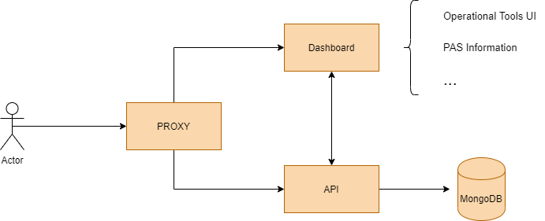
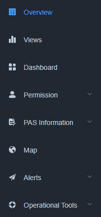

# PIXEL Dashboard & Notifications Documentation Page 

---

## Overview

This documentation explores in detail the PIXEL Dashboard & Notifications as one of the components of the PIXEL architecture. To access the main documentation repository of PIXEL, click [here](https://pixel-ports.readthedocs.io/en/latest/). To access the PIXEL project website, click [here](https://pixel-ports.eu/).

> *PIXEL is the first smart, flexible and scalable solution for reducing environmental impacts while enabling the optimization of operations in port ecosystems through IoT.*

PIXEL enables a two-way collaboration of ports, multimodal transport agents and cities for **optimal use of internal and external resources, sustainable economic growth and environmental impact mitigation, towards the Ports of the Future**. Built on top of the state-of-the art interoperability technologies, PIXEL centralises data from the different information silos where internal and external stakeholders store their operational information. PIXEL leverages an **IoT based communication infrastructure** to voluntarily exchange data among ports and stakeholders to achieve an efficient use of resources in ports.

PIXEL has been financed by the **Horizon 2020 initiative** of the European Commission, contract 769355.  

  

## Summary and Architecture

The Dashboard & Notifications is the component that has the capability of representing data stored in the IH in meaningful **combined visualizations in real time**. Also it provides the capability to **send notifications based on the status of the data** received from the sensors.  Finally, this module **provides (aggregates and homogenises) all the UI for the different functional blocks** (Operational Tools). Dashboard component is divided in two subcomponents:

   - *Frontend*. Offers a web application based on the VueJS Framework. This component exposes the UI with which the user interacts.
   - *Backend*. Exposes all the services needed for the dashboard. Moreover connects to the IDM service to ensure users are authorized. It has a non-relational database and communicates with **PIXEL Operational Tools** for the management of the containers. **Backend** also has a component responsible of alerts.
      - *Backend of alerts*. It has a service that exposes a REST API to create different types of alerts. Once launched they are sent directly to the backend. It requires connection to **PIXEL Information Hub**.

Dashboard has a **Proxy** whose functionality is to maintain a single entry point to the dashboard. There are redirects for all the PIXEL components. All the services must be exposed through this component.

The functional overview of the different options that has the Dashboard are:

   - *Overview*. View where the visualizations created by the end-user and published are shown. In this way, they are accesible as soon as the user accesses to the platform.
   - *Views*. Component responsible for creating the different types of visualizations (**Gantt diagram, Table, etc.**) of the data coming from the sensors.
   - *Dashboard*. UI responsible for creating dashboards using visualizations created in the previous section.
   - *Permission*. Component aligned with **PIXEL Security & Privacy** component in order to fulfill all required security policies (e.g. authentication, authorization, roles, permission, etc.).
   - *PAS Information*. Graphical interface to fill in the differrent entities (**resources, rules and supplier chain**) needed as input for the PAS Model (**Port Activity Scenario**).
   - *Map*. Component that will show geolocated data (sensors, devices,  etc) from the different ports.
   - *Alerts*. Component responsible for **real-time monitoring of data** and trigger alerts depending on their value.
   - *Operational Tools*. User interface to access the functionalities of the Operational Tools.

 
