# User's Guide

## Introduction

Although the PIXEL Platform has 5 components, users interact with it through the dashboard user interface.
The Pixel Dashboard and Notification component provides a web User Interface to interact with the platform. 
It is needed to have an account to access to the platform.

  

## Login

After entering the url of the PIXEL platform, a login form appears allowing you access the application.  You need to have an account to enter into the application. Depending on your permissions you will have different functionalities available.

  

## Layout

The pixel platform has 3 main areas:
  - *Menu*. Provides access to different functionalities. (1)
  - *Header*. Provides navigation and configuration properties. (2)
  - *Content*. Provides the functionalities to interact with. (3)

**Menu** 
The menu allows the user to access all the available functionalities of the platform.
By default, the menu appears in extended mode, but it can be extended through the compact / extend icon.

The functionalities available are:
  - *Overview*. List of information visualization to control port operations.
  - *Views*. Manage the visualizations to be shown in the overview functionality.
  - *Dashboard*. Manage the creation of reports.
  - *Permission*. Manage the roles and uses of the platform.
  - *PAS Information*. Manage the Port Activity Scenario information.
  - *Map*. Geographical information system with real-time sensors.
  - *Alerts*. Manage alerts definition and subscription.
  - *Operational Tools*. Manage Models and Algorithms.

**Header** 
The header provides a ser of functionalities to navigates between different sections, search elements, language selection and profile information.
On the left-hand side, you will find the following functionalities:
 -	*Collapse / Expand menu*
 -	*Breadcrumbs*
 -	*Functionality button bar*

On the right hand-side, you will find the following functionalities:
  - *Search functionality* (1)
  - *Language selection* (2)
  - *Profile options* (3)
  - *Profile details* (4)
  - *LogOut* (5)

**Content** 
The content area is the largest display area and shows the content of the functionality selected in the menu.
At the top, there is a tab bar that allow quick access to previously opened content.

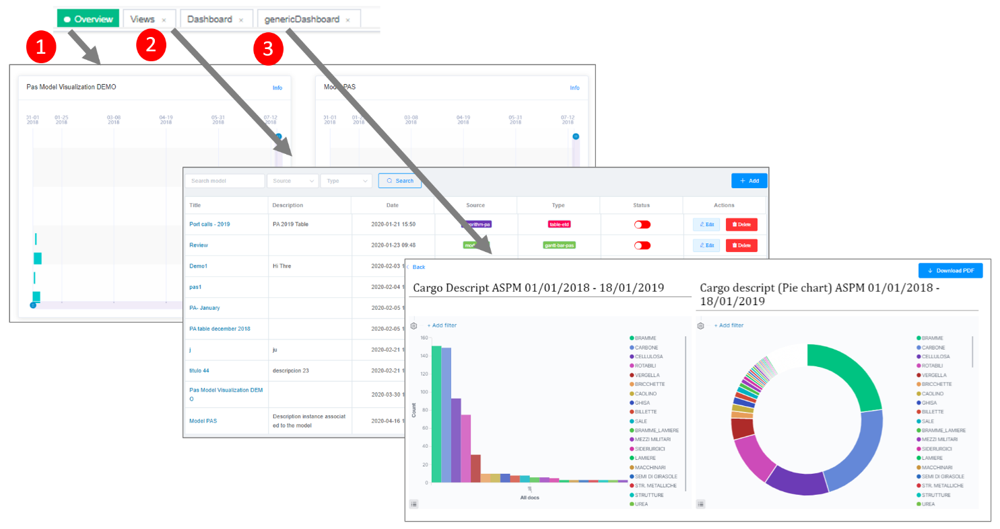

  

## Permission

The permission functionality allows you to manage the roles and users of the platform. This functionality uses internally the security layer of PIXEL.

**Role permission** 
The role permission functionality allows to manage the roles of the platform “the different types of users that will use the platform and what actions they can execute”.
This functionality will only be available to administrators
The list of roles shows the roles defined and provides the functionality to manage them  (Create, Edit, Delete).

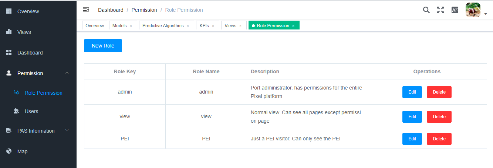

If you want to create a new role, select the "New role" button. After selecting the button, a form appears that allows to define the characteristics of the new role.

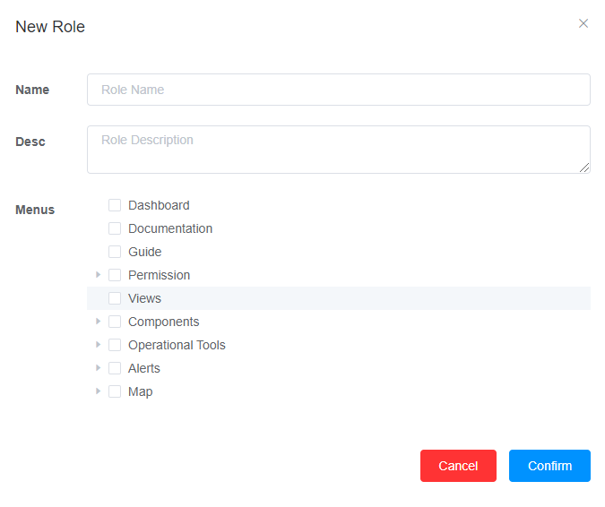

**Users** 
The user functionality allows to manage the users that can access to the platform. In the list of users functionality provides a list of users created.

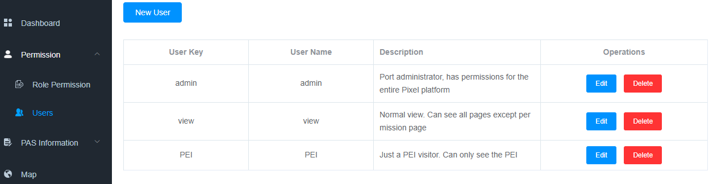

If you want to create a new user, select the "New user" button. After selecting the button, a form appears that allows to define the properties of a new user.

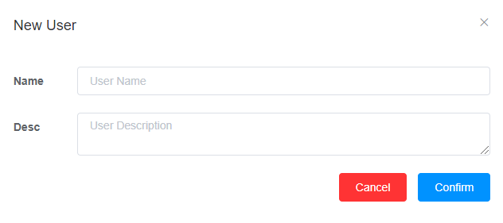

  

## Overview and Views

These functionalities allow to define and show the most suitable visualizations to monitor the port activity depending on the specific needs of each port.

Note: Most of the visualizations that a user can create are related with model executions. Before creating these visualizations, the user has to add a model an run it form the operational tools functionality.

**Views** 
From the *list of views* , the user can manage the mots appropriate visualizations to control the port activity. The list of views provides a search mechanism (1) to filter by name, source or type the views showed in the table. The Add (2) button allows to create a new visualization. For each visualization (4), the user can change the visualization status.   Only the enabled visualization will appear in the overview.

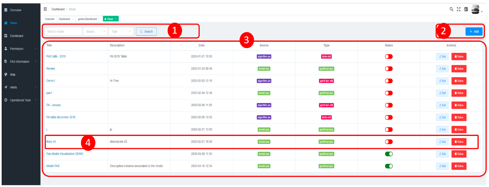

The add visualization functionality has three steps.
  -	1st Step: the user chooses the model for which he wants to create a new visualization. Currently the  platform provides visualization for the PAS model and for the Predictive ETD algorithm. Moreover, the user can create a custom visualization.

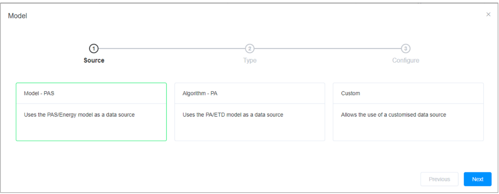

  -	2nd Step: In the second step, the user chooses the visualization most appropriated for the analysis he wants to perform.

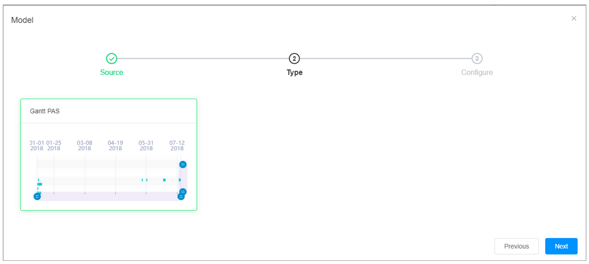

  -	3rd Step: In the third step, the user define the name of the visualization and select the proper model execution to be shown.

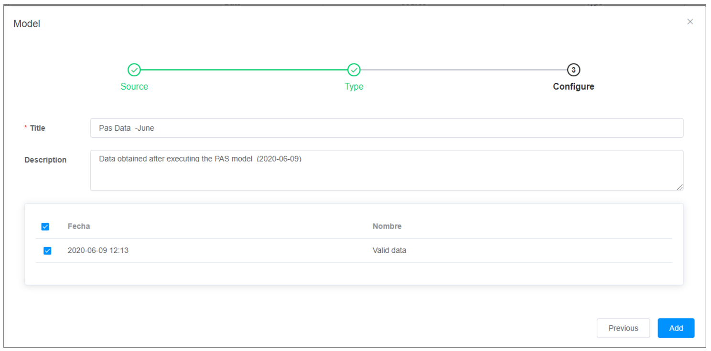

**Process of creating and visualizing a new view** 
To show a new visualization on the overview you need to follow these steps:
  - In the list view, click the add button (1)
  - Complete the three steps for creating a new  visualization (2)
  -	Look for the visualization created (3)
  -	Change the status from disabled to enabled (4)

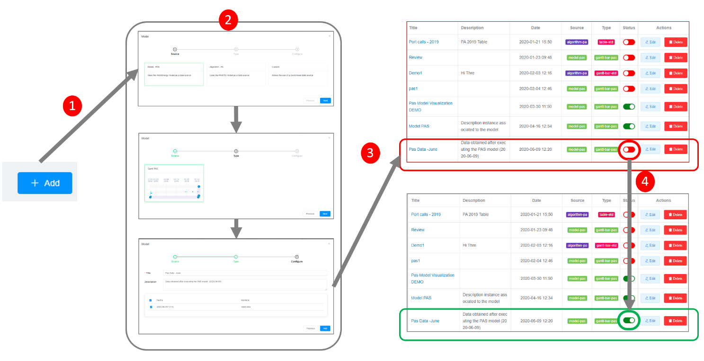

If a user wants to create a custom visualization, independent from any model, in the process of creating a new visualization, the user has to select the custom option in the step 1. In the next figure, you  can see how a user can create a custom visualization to show in an iframe the content of other web.

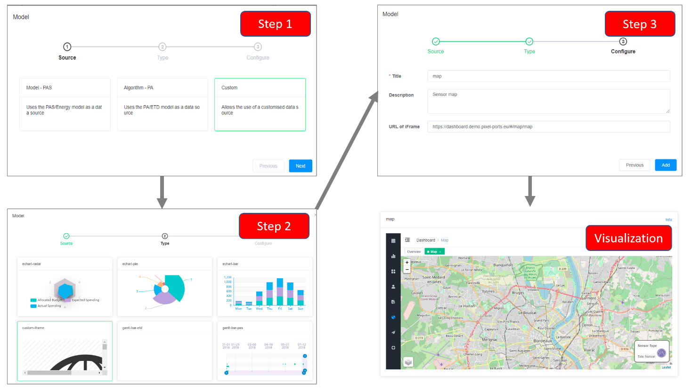

**Overviews** 
The overview is the main control panel to monitor and analyse the port activities.  The overview will show all the enabled views in a table of two cols. Next figure depicts the layout of the visualizations showed in the overview.

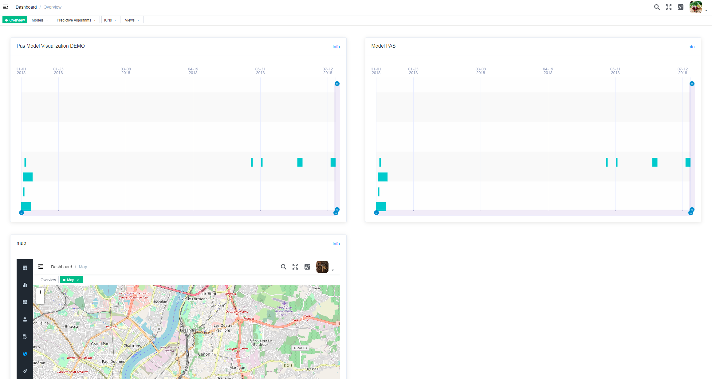

Next picture illustrates an example of the overviews with three visualizations.

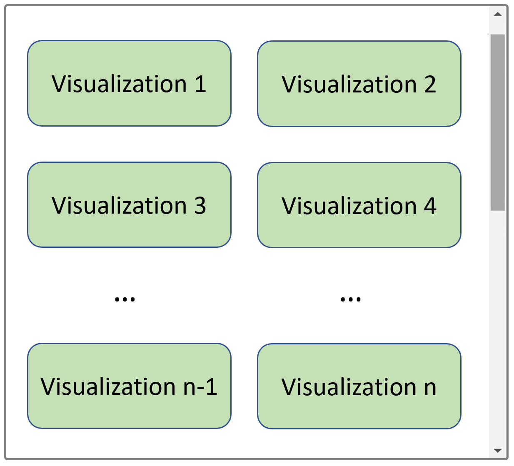

  

## Dashboard - Reporting

This functionality allows the users to create flexible dashboards and reports thanks to a mechanism that lets the user insert different types of information in any place/size of the report. During the creation of the dashboard the user can drag and drop and resize any visual component to make the most adequate report for each case.

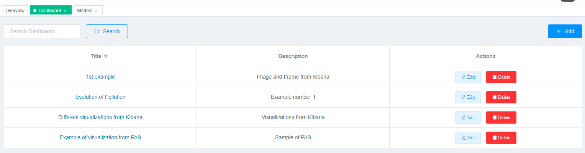

For example:

  - *otools.js*. This is the file where the **PIXEL Operational Tools API endpoints** will be located.

  - *dataextractor_IH.js*. This file centralises all the **IH dataextractor API endpoints**.

  - *PAS_IH.js*. It contains the necessary methods to complete the PAS (Port Activity Scenario) forms. This information is stored in the **PIXEL Information Hub** and in this case there is no specific API. Queries are performed directly using the **elasticsearch REST API**.

  - *resource.js*. It contains the endpoints exposed by the CRUD API created in the server solution.

Each of these files has in common the import that is made in the first line. This imports the request class that will be used for each set of endpoints.

This request class contains:

  - *Base url* used in the request for each endpoint.
  - *Timeout configuration*. Can be different for each API.
  - *Construction of the response object* for each request.

Next figure depicts an example of request class (for the Operational Tools endpoints in this case).

  

### Add a new entity to the server solution

The server solution has been developed following the **MVC pattern (Model-View-Controller)**. Therefore, this pattern will be followed in case to add a new entity that will interact with the Dashboard.

Next figure depicts the folder structure of the server solution.

Among these folders, the following stand out:

  - *controllers*. There will be controllers for each entity. **API entry point**. It is where the redirection of the method exposed to the internal method of our API is done. It makes use of the service classes.

  - *services*. It performs the queries against the database for this purpose makes use of the models.

  - *models*. It is in these classes that the object to be used for our entity will be defined (**properties, relations with other entities, etc.**).

There is a configuration file (index.js) where the developer must add a few lines for each of the entities to be exposed. These lines are related to the controller of the entity. This is because the access point to the API is through the controller.

This file is formed by two blocks:

  - *First block*. Where the **import of the controller's entity** is done.

  - *Second block*. Where the **path of the entity** of that controller is indicated.

  

### Add new visualizations

   
The src/components folder contains the various components of the dashboard client solution.

Among them, the widget folder stands out. This is where the **different widgets / visualizations** used to represent the information within the **PIXEL Platform** are created (displays associated with the execution of a model).

Therefore, in case you want to add a new type of visualization, this is where it should be done.

Currently, this folder is structured in the following subfolders:
  - *amcharts*. Views created using this JavaScript library.
  - *echart*. Views created using this JavaScript library.
  - *custom*. Custom views without the specific use of any JavaScript library.
  - *mixins*. Folder where we have files that help us to represent the visualizations. In this case the file responsible for resizing them (*resize.js*).

 
