# User's Guide

## Introduction

Although the PIXEL Platform has 5 components, users interact with it through the dashboard user interface.
The Pixel Dashboard and Notification component provides a web User Interface to interact with the platform. 
It is needed to have an account to access to the platform.

  

## Login

After entering the url of the PIXEL platform, a login form appears allowing you access the application.  You need to have an account to enter into the application. Depending on your permissions you will have different functionalities available.

  

## Layout

The pixel platform has 3 main areas:
  - *Menu*. Provides access to different functionalities. (1)
  - *Header*. Provides navigation and configuration properties. (2)
  - *Content*. Provides the functionalities to interact with. (3)

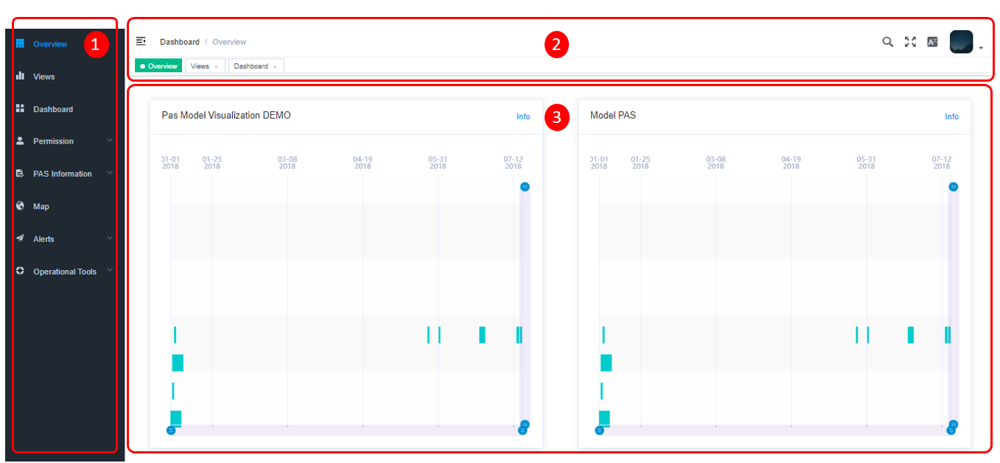

**Menu** 
The menu allows the user to access all the available functionalities of the platform.
By default, the menu appears in extended mode, but it can be extended through the compact / extend icon.

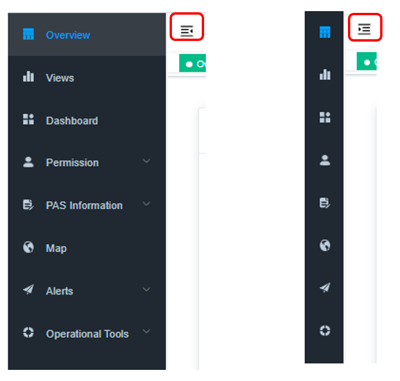

The functionalities available are:
  - *Overview*. List of information visualization to control port operations.
  - *Views*. Manage the visualizations to be shown in the overview functionality.
  - *Dashboard*. Manage the creation of reports.
  - *Permission*. Manage the roles and uses of the platform.
  - *PAS Information*. Manage the Port Activity Scenario information.
  - *Map*. Geographical information system with real-time sensors.
  - *Alerts*. Manage alerts definition and subscription.
  - *Operational Tool. Manage Models and Algorithms.

**Header** 
The header provides a ser of functionalities to navigates between different sections, search elements, language selection and profile information.
On the left-hand side, you will find the following functionalities:
 -	*Collapse / Expand menu*
 -	*Breadcrumbs*
 -	*Functionality button bar*

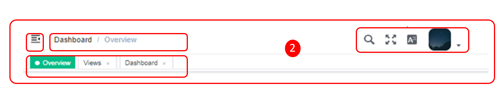

On the right hand-side, you will find the following functionalities:
  - *Search functionality* (1)
  - *Language selection* (2)
  - *Profile options* (3)
  - *Profile details* (4)
  - *LogOut* (5)

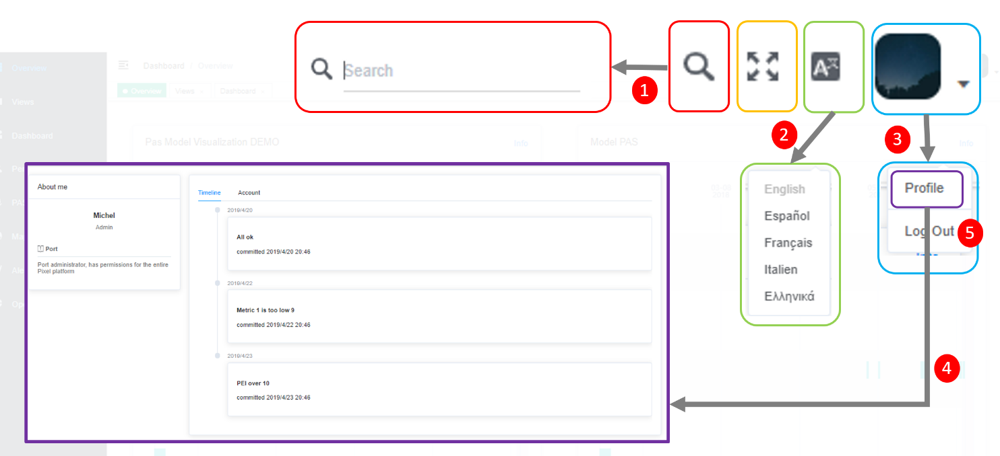

  

## Internationalization

Platform PIXEL has the i18n configurations necessary to give support for the following languages:

  - *English*.
  - *Spanish*.
  - *French*.
  - *Italian*.
  - *Greek*.

The solution includes a folder called lang where the files for each  the languages it supports are located. To identify these languages they are called according to their **ISO Language Codes**. 

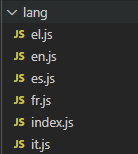

The entries in these files are structured in regions according to the functionality to which the tag to be translated belongs. The figure below depicts the entries within the region alerts for the english file (**en.js**, according to the nomenclature mentioned above).

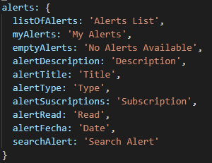

If PIXEL wants to **support a new language**, the developer should go to the  index.js file (in the language folder) and generate the necessary files (according to the content of index.js file). Finally, it will be necessary to create a JavaScript file named with the ISO Code for the new language.

The **syntax of the tag** to be created it will be different depending on its location within the view:
  - *HTML Code*. Next figure illustrates the syntax of the label in this case. This is the title tag within the widget region.

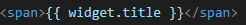

  - *JavaScript Code*. Syntax is different in this case (see next figure). It is necessary to use the **'$t' method** that injects the necessary code to translate the tags by going to the corresponding file and region to retrieve the text of the tag.

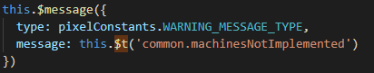

  

## Notifications

PIXEL Dashboard & Notifications includes two options to show notifications or messages to the end-user (without the need to build a custom popup or modal dialog).

  - *Message*. Method used to **notify a message to the end-user**. For example, the result of a validation. There are several levels of notifications: **warning, error or successful**. Also it is possible to indicate the time interval during which the message will be visible. The syntax of this type of notification is depicted in the next figure.

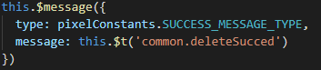

  Previous figure is showing a popup notifying that the delete action has been successful. 
  
  Next picture illustrate the appearance of this type of message. In that case, the result of a validation. A warning message.

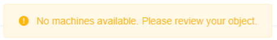

  - *Notification*. Method used to show the **result of an action** (entity created, updated, etc). There are different levels of messages attending to the result or priority of the action: warning, successful, error. The syntax of this type of message is depicted in the next figure.

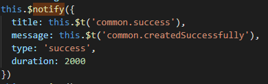

  Previous figure is showing a popup notifying that the entity has been created successfully.

  Next picture illustrates the appearance of this type of notification. In that case, an entity has been updated successfully.

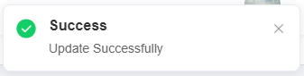

  

## Access to APIs

Dashboard interacts with the APIs of other components (as well as with the API of the server solution). These requests are not made directly from the corresponding view where necessary.

There is a folder called API where there is a JavaScript file for each of the entities or functionalities accessed via API.

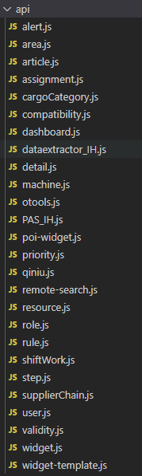

For example:

  - *otools.js*. This is the file where the **PIXEL Operational Tools API endpoints** will be located.

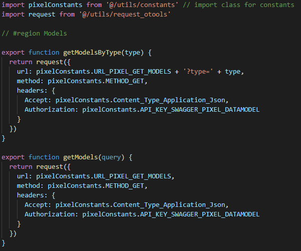

  - *dataextractor_IH.js*. This file centralises all the **IH dataextractor API endpoints**.

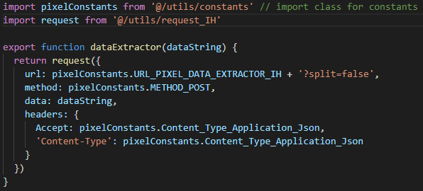

  - *PAS_IH.js*. It contains the necessary methods to complete the PAS (Port Activity Scenario) forms. This information is stored in the **PIXEL Information Hub** and in this case there is no specific API. Queries are performed directly using the **elasticsearch REST API**.

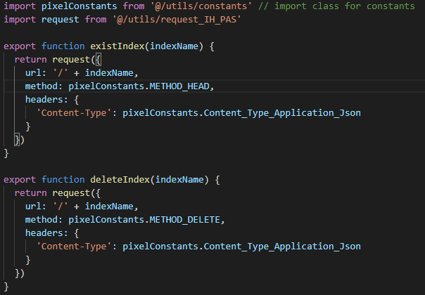

  - *resource.js*. It contains the endpoints exposed by the CRUD API created in the server solution.

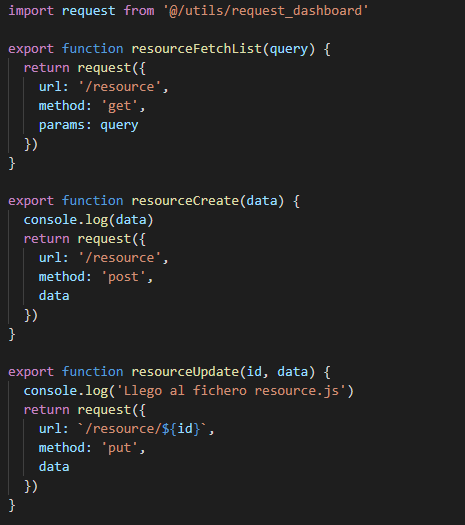

Each of these files has in common the import that is made in the first line. This imports the request class that will be used for each set of endpoints.

This request class contains:

  - *Base url* used in the request for each endpoint.
  - *Timeout configuration*. Can be different for each API.
  - *Construction of the response object* for each request.

Next figure depicts an example of request class (for the Operational Tools endpoints in this case).

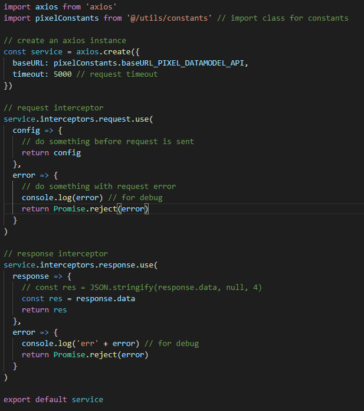

  

### Add a new entity to the server solution

The server solution has been developed following the **MVC pattern (Model-View-Controller)**. Therefore, this pattern will be followed in case to add a new entity that will interact with the Dashboard.

Next figure depicts the folder structure of the server solution.

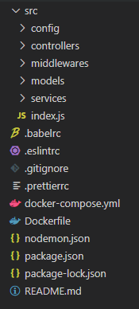

Among these folders, the following stand out:

  - *controllers*. There will be controllers for each entity. **API entry point**. It is where the redirection of the method exposed to the internal method of our API is done. It makes use of the service classes.

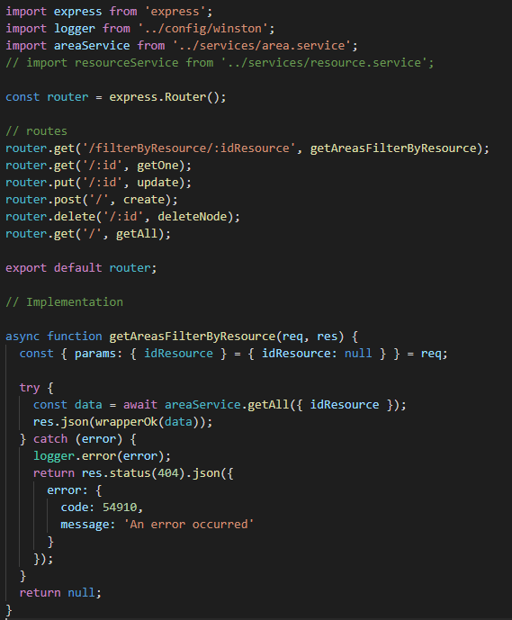

  - *services*. It performs the queries against the database for this purpose makes use of the models.

  - *models*. It is in these classes that the object to be used for our entity will be defined (**properties, relations with other entities, etc.**).

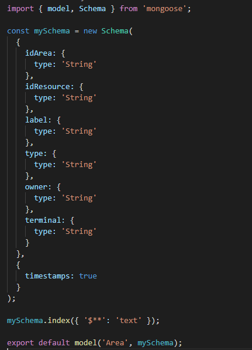

There is a configuration file (index.js) where the developer must add a few lines for each of the entities to be exposed. These lines are related to the controller of the entity. This is because the access point to the API is through the controller.

This file is formed by two blocks:

  - *First block*. Where the **import of the controller's entity** is done.

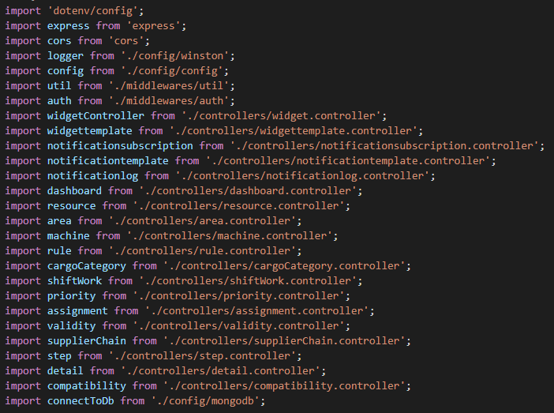

  - *Second block*. Where the **path of the entity** of that controller is indicated.

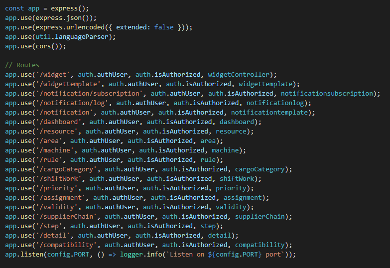

  

### Add new visualizations

   
The src/components folder contains the various components of the dashboard client solution.

Among them, the widget folder stands out. This is where the **different widgets / visualizations** used to represent the information within the **PIXEL Platform** are created (displays associated with the execution of a model).

Therefore, in case you want to add a new type of visualization, this is where it should be done.

Currently, this folder is structured in the following subfolders:
  - *amcharts*. Views created using this JavaScript library.
  - *echart*. Views created using this JavaScript library.
  - *custom*. Custom views without the specific use of any JavaScript library.
  - *mixins*. Folder where we have files that help us to represent the visualizations. In this case the file responsible for resizing them (*resize.js*).

 
